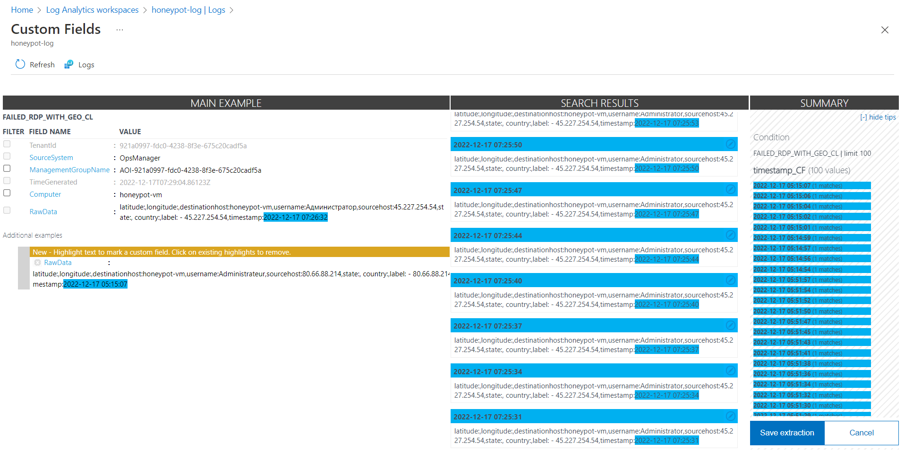

# Microsoft Azure Sentinel Attack Map

### Summary
This is a home lab project I worked on in order to better understand Microsoft's Azure Sentinel SIEM. I documented all of the steps taken to complete this lab.

### The following skills were utilized:
- Configuration & Deployment of Azure resources such as virtual machines, Log Analytics Workspaces, and Azure Sentinel
- Hands-on experience and working knowledge of a SIEM Log Management Tool (Microsoft's Azure Sentinel)
- Understand Windows Security Event logs
- Utilization of KQL to query logs
- Display attack data on a dashboard with Workbooks (World Map)

### Tools Utilized:

1. Microsoft Azure
2. Azure Sentinel
3. Kusto Query Language (KQL - Used to build world map)
4. Network Security Groups (Layer 4/3 Firewall in Azure)
5. Remote Desktop Protocol (RDP)
6. 3rd Party API: [ipgeolocation.io](https://ipgeolocation.io/)
7. Custom [Powershell Script](https://github.com/joshmadakor1/Sentinel-Lab/blob/main/Custom_Security_Log_Exporter.ps1) written by Josh Madakor


### Overview:


## Step 1: Created a Honeypot Virtual Machine
- Signed into portal.azure.com
- Searched for "virtual machines" 
- Selected Create > Azure virtual machine


### Virtual Machine Details
The following information is what I used to setup the initial virtual machine


### Networking
#### Network interface
I edited the NIC network security group to allow all incoming traffick to into the virtual machine. 
- NIC network security group: Advanced > Create new
- I Removed the Default Inbound rules. 
- The Destination port ranges needed to be changed to, "*", as this is a wildcard allowing ALL ports to be opened.
- Also set the Priority: 100 (low)


> Configuring the firewall to allow traffic from anywhere will make the VM easily discoverable.

## Step 3: Created a Log Analytics Workspace
- Searching for "Log analytics workspaces" and created the Log Analytics Workspace and ensured it had the same resource group as VM (honeypotlab)


> The Windows Event Viewer logs will be ingested into Log Analytics workspaces in addition to custom logs with geographic data to map attacker locations.

## Step 4: Configured Microsoft Defender for Cloud
- In "Microsoft Defender for Cloud", you will need to change the settings in order to allow the server to ingest logs into the Log ANalytics Workspace.
- Scroll dow "Environment settings" > subscription name > log analytics workspace name (log-honeypot)


#### Settings | Defender plans
- You will need to turn on Servers in the Defender Plan, and leave SQL servers ON machines OFF 


#### Settings | Configured Data collection
- Select "All Events" to grab all events from EventViewer on the Virtual Machine

## Step 5: Connected Log Analytics Workspace to Virtual Machine
- Navigated back to Log Analytics workspaces and under Virtual Machines, selected the virtual machine and connected.


## Step 6: Configured Microsoft Sentinel
- Searched for "Microsoft Sentinel" and created the enviornment. Also linked the Log Analytics workspace to Microsoft Sentinel


## Step 7: Disabled the Firewall in Virtual Machine
- Connected to the Virtual Machine using the public IP address and on my desktop through Windows RDP. Signed in using the credentials created and disabled Windows Firewall. Ensured it was disabled by using the 'ping -t' command on my desktop, ensuring I was able to reach the external IP address of the VM.


## Step 8: Scripting the Security Log Exporter
- I needed to link the ipgeolocation api to the desktop in order to create a log file I could ingest into Azure Sentinel. I was able to find a script that allowed me to do so. I changed the API Key in the powershell script and saved it to the VM's desktop. After saved, I was able to run the script.


> The script will export data from the Windows Event Viewer to then import into the IP Geolocation service. It will then extract the latitude and longitude and then create a new log called failed_rdp.log in the following location: C:\ProgramData\failed_rdp.log

## Step 9: Created Custom Log in Log Analytics Workspace
In order to map the geolocation of the attackers, I needed to create a custom log to import the data from the IP Geolocation service into Azure Sentinel.
- First I would need sample logs on the VM in order to create these custom logs. From the script, they could be found on C:\ProgramData and I was able to grab the logs.
- Back in Azure, in Log Analytics workspaces. Under Tables, I created a new MMA-based custom log
- 


## Step 10: Queried the Custom Log
- Ensured the logs were showing in Log Analytics through a query.


## Step 11: Extract Fields from Custom Log 
> The RawData within a log contains information such as latitude, longitude, destinationhost, etc. I needed to separate these fields in order to plot on a map in Azure Sentinel. I perofrmed the following steps to do so:
- Right clicked on log reuslts
- Extracted the field and selected the appropriate data
- I was able to give the Field a title and extract the raw data into the new field.
- Repeated these steps until I created all the necessary fields



## Step 12: Mapped Data in Microsoft Sentinel
- In Microsoft Sentinel I created a new workbook and ran the following query to import the data from the custom log.

```KQL
FAILED_RDP_WITH_GEO_CL | summarize event_count=count() by sourcehost_CF, latitude_CF, longitude_CF, country_CF, label_CF, destinationhost_CF
| where destinationhost_CF != "samplehost"
| where sourcehost_CF != ""
```

- I then went to **Visualization** and selected **Map**
- I was then able to configure the map settings to match the fields I created from the logs

## Final Results and Conclusion
> Although this is a lab, I have used these findings for creating and enforcing policies for organizations by:
- Configuring conditional access policies can be created in Azure in order to restrict access from certain regions.
- Implement vulnerability management solutions as running network and credentialed scans on endpoints can help remediate attackers from trying to enter through open ports or discovering this system. 
- From logs generated, we can see users are trying to login by entering common passwords. Enforcing a password policy, password manager, and multi-factor authentication are typical steps taken to prevent access.


